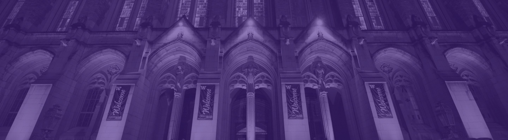

 

### Sociology 403 Research Practicum

On March 6, only weeks before the start of the Spring quarter, the University of Washington suspended in-person instruction due to the outbreak of COVID-19. The spring 2020 quarter has been conducted entirely online, including our class. Typically, SOC 403 classes decide on a research topic with the help of our friends at the City of Seattle. Past classes have studied a variety of issues, most recently how undergraduate students are impacted by labor and housing policies.

This quarter we studied how **undergraduate students in Washington State** are dealing with the changes related to COVID-19. We believe our research is important because students will likely experience the crisis in a way that is unique from other groups. Undergraduate students are at a formative stage of life where they learn important skills to enter the labor market, (often) learn how to live on their own, and make social ties that provide benefits long into the future. College experiences teach students how to act in various social and professional contexts, socializing them in adult life. Disruption of and changes to these processes may have long-term consequences, so understanding the changes experienced by students is key. 

We believe our research is important because students will likely experience the crisis in a way that is unique from other groups. Undergraduate students are at a formative stage of life where they learn important skills to enter the labor market, (often) learn how to live on their own, and make social ties that provide benefits long into the future. College experiences teach students how to act in various social and professional contexts, socializing them in adult life. Disruption of and changes to these processes may have long-term consequences, so understanding the changes experienced by students is key. 

---

### Research Team 

**Instructor:**\
Steven M. Karceski 

**Students:**\
Nathan Abei, Bezawit Belete, Alex Chan, Kevin Daugard, Jessica Edge,\
Kenton Ho, Neil Kato, Xiaoran Liu, Allan Louie, Yasmin Solano, Colin Yao

