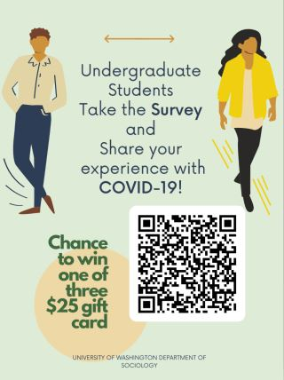

---

### Research Question:

#### How is the outbreak of COVID-19 affecting undergraduate students in Washington State?

### Data Collection

To investigate how undergraduate students are dealing with the changes associated with the outbreak of COVID-19 and the transition to online learning we collected data with a survey and follow-up interviews. 

### Creating The Survey

In order to determine the impact of COVID-19 on undergraduate students in Washington State, we used a survey with the option of an follow-up interviews. We created the survey with Google Forms. Google Forms allowed all of us to simultaneously collaborate and share information while working remotely via a virtual classroom. Our survey focuses on four main areas: (1) online learning experience; (2) graduation and post-graduation plans; (3) social, physical, and mental health, and (4) economic and financial characteristics. Given the large amount of overlap and connection between certain topics, using four main themes will provide the most detailed and straightforward description of our findings.The survey features both closed and open-ended  

### Distributing The Survey

Due to the current Stay Home, Stay Healthy order in Washington State, we were limited in our means to promote participation. Promotional methods proven to be effective in the past were not an option, such as passing out flyers around campus, administering the survey in-person with iPads (also on campus), and posting flyers on and off campus

The constraints related to quarantine and online learning meant we primarily relied on social media and our personal networks. We created digital advertisements to circulate around social media, among our friends, and to instructors and professors. These platforms include Twitter, Instagram, Facebook, and Tinder (the latter not working nearly as well as the others). We attempted posting into university-specific Reddit communities, however moderator regulations eliminated this option. Using Facebook allowed us to target specific universities throughout the state of Washington through the use of different groups and public pages. However, Facebook's privacy features made it impossible to access certain groups that may have led to more responses. 

Since we could not physically hand out flyers containing our survey information, we had to be extra diligent in sending digital ones to our friends, family members, and members of groups which fit our target population. Given the high proportion of the sample from the University of Washington, sharing our survey throughout our own personal social networks via email, text messages, and messaging applications appears to be the most effective method to generate responses. 

 

### Our Survey Sample

Our survey went live on **May 7, 2020** and was closed on **May 27, 2020**. The survey was up for 20 days and garnered a total of 198 responses. Out of the 198 responses roughly 73% attended one of the three University of Washington campuses, which, again, is likely the result of primarily distributing our survey through our own social networks. This is likely the result of primarily distributing our survey through our own social networks. As University of Washington students, the majority of professors, undergraduate students, and student organizations that we know are members of the University of Washington.

We were only able to obtain a few responses from schools outside of Western Washington University, Gonzaga University, Highline College, and the University of Washington. We expected to get more responses from the fairly large public universities in the state, such as Washington State University, Eastern Washington University, and Central Washington University, but our recruitment in these universities was relatively unsuccessful.
